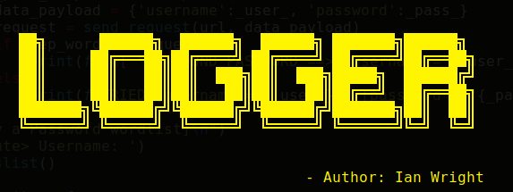

# Logger-Bruteforcer

Logger is a bruteforce script built on python 3.6.7 for web forms. It still can be developed further with more python libraries.
Logger uses requests, a python library that handles http requests, it sets up a session and a header to maintain the connection as it tries, the username, password combinations. 

It gives choices to:
a) load both user and password wordlists or 
b) defining the usernames but loading the password wordlist only.

#happy hacking
